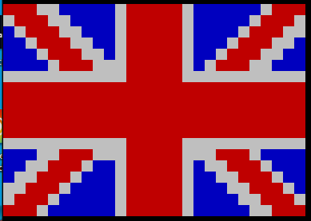
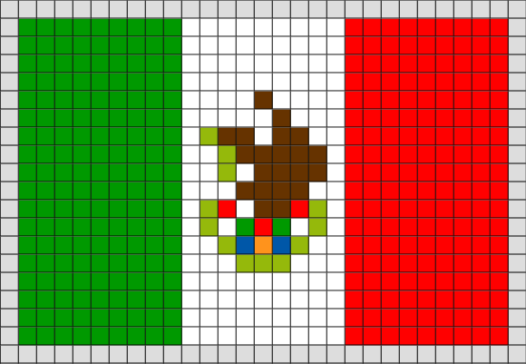

# Fun with flags!

## Tener en cuenta:

- Proyecto en parejas
- Se debe crear un repositorio por equipo
- Se debe subir varios commits y push dependiendo de la estrategía de solución del proyecto
- Se debe interactuar con un archivo, el cual será construído entre todos los estudiantes

## Criterios de evaluación:

- 10% Trabajo en el repositorio, mínimo 15 commits por cada estudiantes para terminar el proyecto
- 10% Diseño en java de dos banderas diferentes, la lista del grupo no puede tener banderas repetidas
- 10% Subir el diseño de banderas correspondiente en este repositorio como pull request
- 10% Configuración y programación menú
- 25% Programación del juego y la interfaz gráfica
- 20% Exposición entrega final ejercicio (Diapositivas y presentación)
- 5% Buenas prácticas en el código
- 10% Aplicación del concepto de funciones en el proyecto

## Instrucciones de cada bandera

1. Las banderas se guardaran en el archivo /recursos/info_banderas.csv

2. Este archivo guardará, el nombre de la bandera, seguido de los datos del juego en una línea y a continuación la información de cada pixel de cada celda, usando un digito para el color, como se explicará en el paso 4

3. Todas las banderas tendran un estilo pixel art, como el ejemplo a continuación.

 

4. Dibujar la bandera separando colores para cada pixel, según la siguiente lista

	- 1 : Rojo
	- 2 : Azul
	- 3 : Blanco
	- 4 : Amarillo
	- 5 : Verde
	- 6 : Morado
	- 7 : Cyan
	- 8 : Negro
	- 9 : Gris

5. Si algún color de la bandera no esta en la lista, se debe usar un color sustituto, que permita que la bandera se entienda

6. Si la bandera tiene un escudo o adorno, se debe aproximar según criterio del estudiante. Dos ejemplos, Mejico y Costa Rica.

## Helpers

Son programas de java, con funciones listas, que el estudiante podrá usar como ayuda para realizar operaciones en el juego.

- ConsoleColors: Contiene la información de los colores
- ConsoleFile: Realiza operaciones con archivos
- ConsoleInput: Permite leer datos que el usuario ingrese

## Plantilla para imprimir

- [Plnatilla - formato carta](recursos/guia_imprimible_bandera.pdf)

## Referencias

- [Flag Game](http://www.flag-game.com/)
- [Flagpedia](https://flagpedia.net/continent/south-america/quiz)
- [Fun with flags](http://fun-with-flags.com/)
- [Game brains](https://www.gamesforthebrain.com/game/flag/)
- [Flag Games](https://www.proprofs.com/games/flags/)

## Inspiración

- [Fun with flags - Big Bang Theory](https://www.youtube.com/watch?v=cobmapyCgKA)
